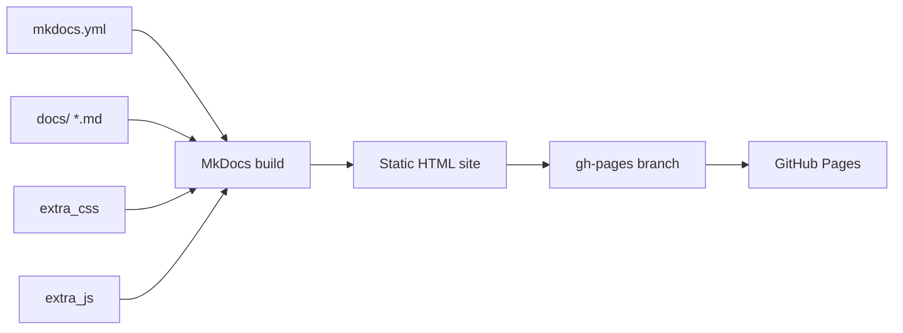

# Architecture

How the pieces of **gh-mkpage** fit together — from config to custom JS to deployment.

## Layers

## Component guide

| Component | Location | Purpose |
|-----------|----------|---------|
| Site config | `mkdocs.yml` | Theme, nav, extensions, plugins |
| Custom CSS | `docs/stylesheets/extra.css` | Style picker modal, page transitions |
| Custom JS | `docs/javascripts/prefs.js` | Style picker logic, palette persistence |
| Custom JS | `docs/javascripts/mermaid-zoom.js` | Mermaid diagram zoom + pan |
| Content | `docs/` | All markdown pages |
| Skills | `.agents/skills/` | Agent skill instructions |
| Hooks | `.githooks/` | Pre-commit demo enforcement |
| CI/CD | `.github/workflows/` | Build, deploy, CodeQL |
