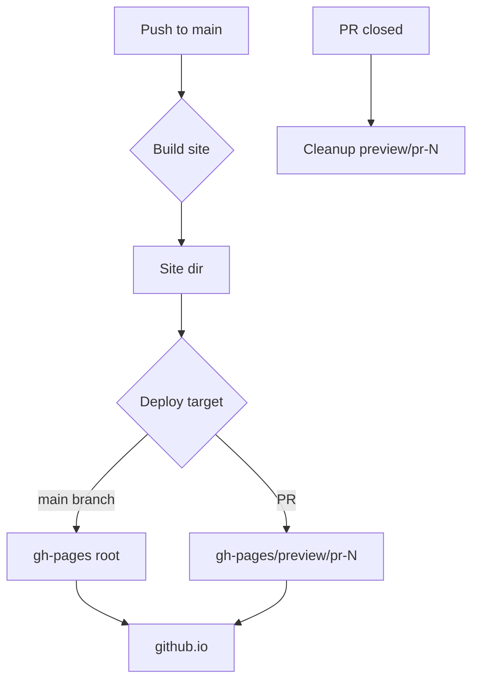
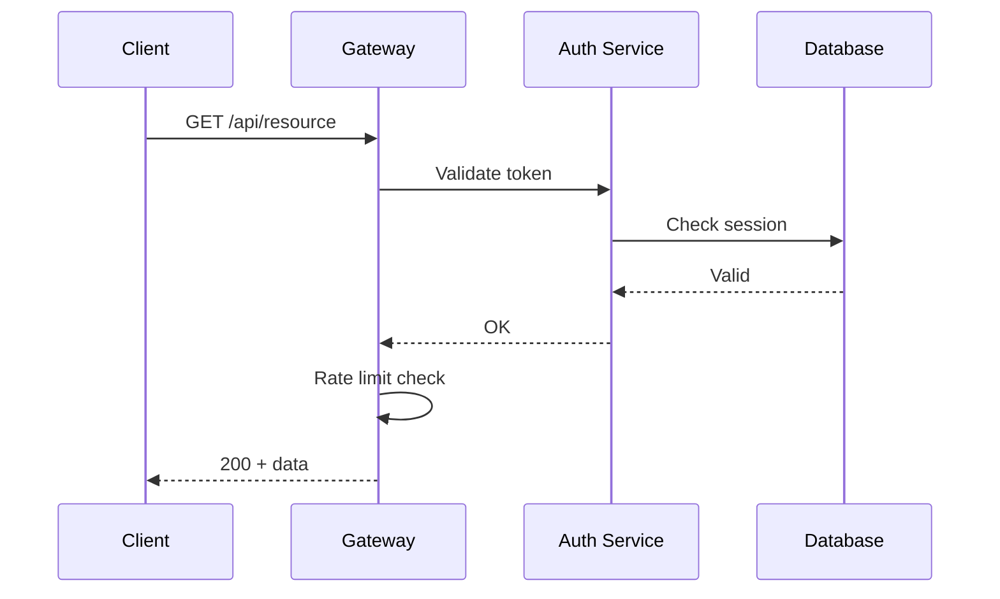
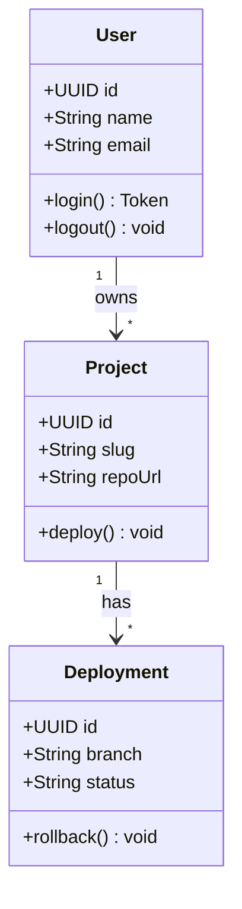
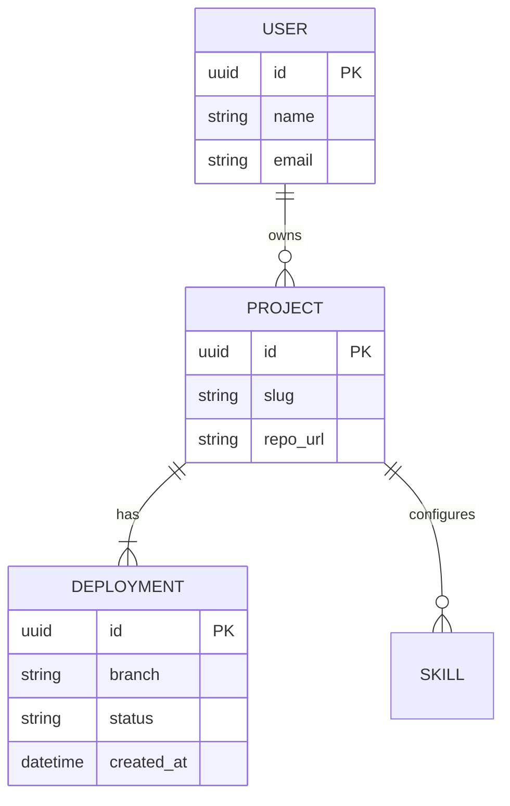
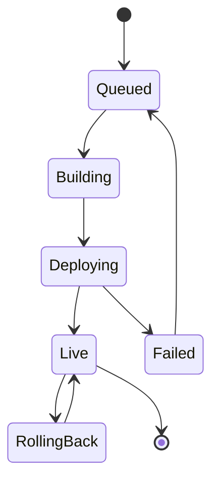
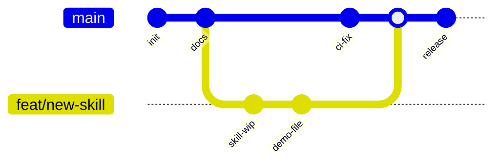
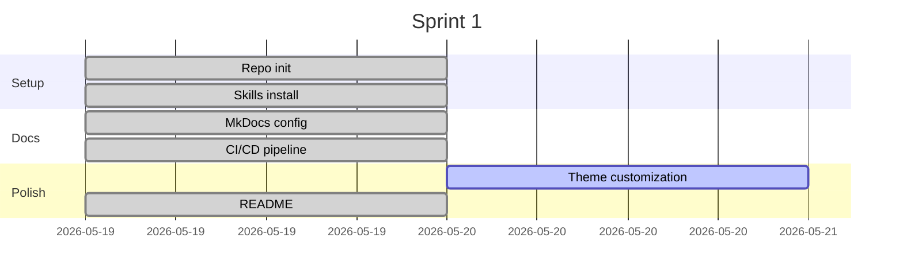

# Mermaid Diagrams Demo

Create professional software diagrams from text. Zoom/pan with mouse wheel + drag.

## Diagram types

### Flowchart — CI/CD pipeline

### Sequence — API auth flow

### Class — Domain model

### Entity Relationship — Schema

### State — Deployment lifecycle

### Git graph — Branch strategy

### Gantt — Sprint timeline

## ROI to human

Diagrams that live in version control, stay current with code, and render anywhere.
