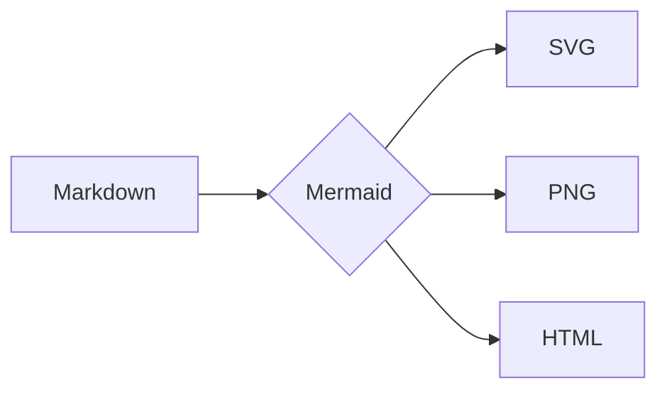

# Mermaid Diagrams Demo

Create professional software diagrams from text definitions. Diagrams are version-controllable and maintainable alongside code.

**Supported types:** class, sequence, flowchart, ERD, C4 architecture, state, git graph, pie, gantt

**Usage:** "diagram this flow", "visualize this architecture", "map out this process"

